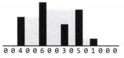

### Question

Imagine a histogram (bar graph). Design an algorithm to compute the volume of water it could hold if someone poured water across the top. You can assume that each histogram bar has width `1`.

### Example

- Input: {0, 0, 4, 0, 0, 6, 0, 0, 3, 0, 5, 0, 1, 0, 0, 0}

(Black bars are the histogram. Gray is water.)

- Output: 26
