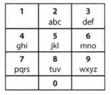

### Question

On old cell phones, users typed on a numeric keypad and the phone would provide a list of words that matched these numbers. Each digit mapped to a set of 0 - 4 letters. Implement an algorithm to return a list of matching words, given a sequence of digits. You are provided a list of valid words (provided in whatever data structure you'd like). The mapping is shown in the diagram below:

### Example

- Input: 8733
- Output: tree, used
